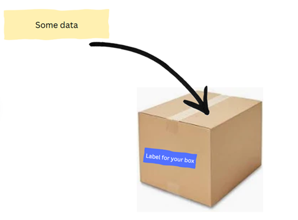

# Variables in C#

## Content
1. [Top Level Statments](#top-level-statments)
2. [Variables](#variables)
3. [Data types](#data-types)
4. [String Interpolation](#string-interpolation)  
    4.1. [Value types vs Reference types](#value-types-vs-reference-types)  
    4.2 [Predefined types](#predefined-types)
5. [Numeric values](#numeric-values)
6. [Interacting with the console](#interacting-with-the-console)
7. [String Interpolation](#string-interpolation)

--- 

### Top level statments

Starting with C#9, top level statments were introduced. They simplify the structure of a program because we can write executable code directly without explicity declaring a **`Program class`** or **`Main`**  method.

```csharp
using System;
 namespace Variables
 {
 internal class Program 
    {
        static void Main(string[] args)
         {
             Console.WriteLine("hello world!");           
          }
     }
}

```

* `using System;`: allows the code to use classes and other types defined in the System namespace without needing to fully qualify their names.
* `namespace Variables`: Namespaces are used to organize code and prevent naming conflicts by grouping related classes, interfaces, and functions together.
* `internal class Program`: Defines a **class** named Program with an **access modifier** `internal`.
* `static void Main()`: It is the entry point of a program. It is the firts method that is executed in a console application.

---

### Variables

I like to imagine a variable like a box. We are going to hold data in that boxes.



however to define a variable, we need to specify its data type.

Declaring a variable and initializing it with data:

`Syntax: data_type name_of_your_variable = some_data`

Example:
```csharp
string fullName = "Jose";`
```


If we want to display the value of a variable we are goin to use `Console.Write(variable_name);` or `Console.WriteLine(variable_name);`.

Example:
```csharp
Console.WriteLine(fullName); // Output: Jose
```

Notes: 
* In **C#** each command or statement must end with a semicolon symbol `;`
* Because C# is a strongly-typed language, once a variable is assigned a type, its type cannot be changed directly.

--- 

### Data Types:

[Types: Oficial documentation](https://learn.microsoft.com/en-us/dotnet/csharp/language-reference/builtin-types/value-types)

All values in C# are instances of a type. All c# types fall into the following categories:
* Value types
* Reference types
* Generic type parameters
* Pointer types

#### Value types vs reference types

The content of a value type variable or constant is simply a value.
**Value types:**
* Value types are stored in the stack. This is a region of memory that is organized in a last-in-first-out (LIFO) manner. 
* They occupy precisely the memory required to store their fields.
* Each value type variable contains its own data directly.
* When you assign one value type variable to another, a copy of the value is made. Changes to one variable do not affect the other.
* Value types are generally faster to access because they are stored on the stack, which has fast access time.
* Primitive data types such as int, float, double, bool, char. Structs (including user-defined structs like Point).

Example: 

```csharp
 public struct Point { public int X; public int Y; } // public struct Point { public int X, Y; }  Structures (structs) in C# are value types that can contain data and methods. 
 ```

Note:
* During this course we'll understand what `struct` and other keywords mean.


**Reference types:**
* Reference types are stored in the heap. The stack contains a reference (pointer) to the actual data, which resides in the heap.
* When you assign one reference type variable to another, you copy the reference, not the actual object. Both variables then refer to the same object. 
* Changes made through one variable will be reflected in the other.
* Accessing data through references can be slower due to the additional layer of indirection (following the reference to the heap). 
* However, reference types are more flexible and can represent more complex data structures: `Classes`, `arrays`, `delegates`, `strings`.

Example:
```csharp
public class PointClass { public int X; public int Y; }
``` 

#### Predefined Types

**Value types:**
* Numeric:
    * Signed integer (sbyte, short, int, long)
    * Unsigned integer (byte, ushort, uint, ulong)
    * Real number (float, double, decimal)
* Logical (bool)
* Character (char)
* Reference types:
* String (string)
* Object (object)

---

### Numeric Values 
`Numeric Literals`: Numeric literals in C# represent fixed values directly written in the code that correspond to numbers. 
 
* Integer Literals: Integer literals represent whole numbers.
    * Decimal:Regular numbers without a prefix. int decimalNumber = 1234;
    * Hexadecimal: Prefixed with 0x or 0X. int hexNumber = 0x1A3F;
    * Binary: Prefixed with 0b or 0B. int binaryNumber = 0b1010;
    * Underscore in Literals: For better readability, underscores can be used to separate digits. int largeNumber = 1_000_000; 
    
* Floating-Point Literals: Floating-point literals represent numbers with fractional parts.      
    * Decimal: Without any suffix, considered as double by default. double decimalDouble = 1234.56;
    * Scientific Notation: Uses e or E to denote the power of 10. double scientificNotation = 1.23e4; // 1.23 × 10^4

* Suffixes for type Specification:
    * f or F for float.
    * d or D for double (optional as double is the default).
    * m or M for decimal.


Examples:

```csharp
x = 1_000_000;
Console.WriteLine(x);
// Getting the type of the variable x
Console.WriteLine(x.GetType()); // Output: System.Int32

// float myFloat = 4.7; Output: error CS0664: Literal of type double cannot be implicitly converted to type 'float'; use an 'F' suffix to create a literal of this type

float myFloat = 4.7f;
Console.WriteLine(myFloat);

```
Note: 

* We use the method `.GetType()` to know the type of a variable/

---

### Numeric conversions

* Converting between integral types 
* Integral type conversions are implicit when the destination type can represent every
// possible value of the source type. Otherwise, an explicit conversion is required;

```csharp
x = 12345; // int is a 32-bit integer
long y = x; // Implicit conversion to 64-bit integral type
short z = (short)x; // Explicit conversion to 16-bit integral type
```

### Interacting with the Console
Using the `Console.ReadLine()` command, we can interact with the console and input data, which is then stored in a variable. The entered data is automatically converted to a string type.

Example:
```csharp
fullName = Console.ReadLine();
```

Note:
* If you need to work with the input as another type (e.g., int or double), you can use method `.Parse()` for example `like int.Parse()` or `double.Parse()` to convert the input string.
Example:
```csharp
int age = int.Parse(Console.Readline()) // Converto from string to int
```

### String interpolation

We can display a string and variables together on the screen using the `$` symbol. This allows for cleaner and more readable code when combining variables within strings.
By placing variables inside curly braces `{}` within the string, variables are automatically replaced with their values.

Example
```csharp
Console.WriteLine("Introduce your age");
int age = int.Parse(Console.ReadLine()); // Read the input from the user and convert it to an integer
Console.WriteLine($"I am {age} years old."); // Display the age entered by the user
```