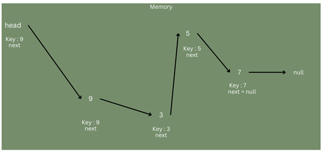
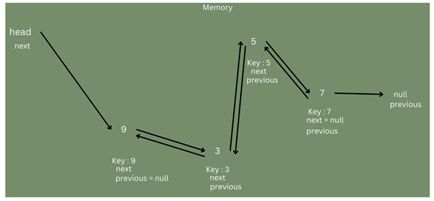
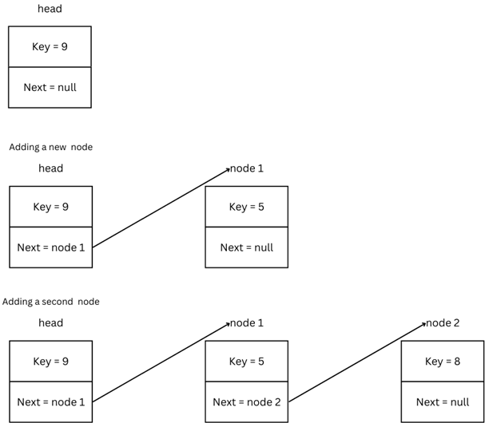
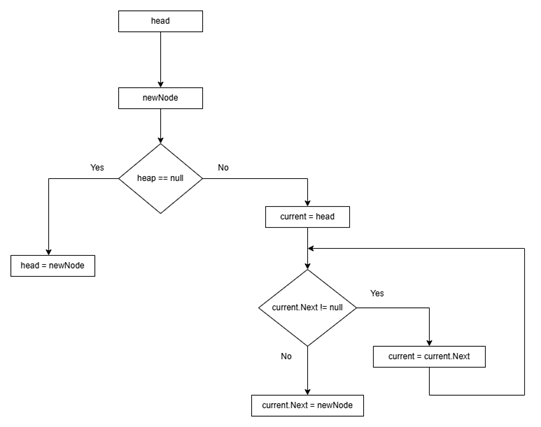

# Data Structures

Data structures are a way of organizing and storing data.


## Content
1. [Lists](#lists)
2. [Arrays](#arrays)
3. [Linked Lists](#linked-list)
4. [Dictionaries](#dictionaries)
5. [Stacks](#stacks)
6. [Queues](#queues)
7. [Hash Tables](#hash-tables)
8. [Trees](#trees)
9. [Graphs](#graphs)


### Lists

A `list` in C# is an **ordered collection** of objects. It is a predefined class in the .NET framework, and objects in the list must be of a specified type, such as string, int, etc.  

One of the key features of a list is that it is a `dynamic` data structure, meaning its size can grow or shrink as elements are added or removed.  
This flexibility makes it a powerful tool for handling data collections. Additionally, lists provide various methods to manipulate data, such as adding, removing, and searching for elements, making them ideal for use in many programming scenarios.


Since List is a `class` (you can read the official documentation [here](https://learn.microsoft.com/en-us/dotnet/api/system.collections.generic.list-1?view=net-9.0)), we need to create an `instance` of the class to use it. This involves declaring a variable of type `List<T>`, where *T* represents the type of elements the list will hold, and then initializing the list.

**Note:** We will cover the topic of Object-Oriented Programming (OOP) soon, which will help explain how classes and objects work in more detail.

```csharp
// Creating an object of type List (instance of the List class)
List<string> fruits = new List<string>(); // Initialize an empty list

// Creating an object with default values
List<int> numbers = new List<int>{2, 3, 4, 5, 6, 7, 8} // Initialize a list with values
```

We can access to a single elment by its index. The first element in a list has a index = 0.

```csharp
numbers[0] // 2
numbers[1] // 3
number[3] // 5
```
If we want to display the elements of the list we can use a for loop with the `List` *property* `.Count`
```csharp
for(int index = 0; index < numbers.Count; index++) 
{
    Console.WriteLine(numbers[index]); // Display all elements in the list
}
```
**Note:** `Count` gets the number of elements in the list.

There is a different syntax to iterate over a list. Using the [`foreach`](https://learn.microsoft.com/en-us/dotnet/csharp/language-reference/statements/iteration-statements#the-foreach-statement) loop.
`foreach` execute a statement or block of statements *for each element* in the list.

```csharp
foreach(int number in numbers) //iterates through each element in the list "numbers"
{
    Console.WriteLine(number);
}
```

#### List Methods

The main methods that we are going to cover are:

**Note:** For the rest of methods check the [documentation](https://learn.microsoft.com/en-us/dotnet/api/system.collections.generic.list-1?view=net-9.0#methods)


**Add():** if we want to add an object to the end of the List.

```csharp
fruits.Add("Apple"); // Adds the string Apple to the list.
```

**Contains(element):** Check if the element is in the list or not. Returns true or false
```csharp
Console.WriteLine(fruits.Contains("Apple")); // Displays True
Console.WriteLine(fruits.Contains("Banana")); // Displays False
```

**IndexOf(element):** Returns the index of the first occurence of the element. If the element is not in the list returns `-1`
```csharp
fruits.IndexOf("Apple"); // returns 0
fruits.IndexOf("Banana"); // returns -1
```
**LastIndexOf(element):** Returns the index of the last occurence of the element. If the element is not in the list returns `-1`  

**Remove(element):** Remove the first element occurrence in the list. Returns true if the element is removed and false if the element is not removed.  
Imagine we have a list with the following elements: `Apple`, `Banana`, `Strawberry`, `Orange`, `Mango`

```csharp
fruits.Remove("Banana"); // Now the elements in the list are: "Apple", "Strawberry", "Orange", "Mango"
```

**RemoveAt(index):** Remove the element at the specified index.
```csharp
fruits.Remove(2); // Remove the element in the index 2. Now the elements in the list are: "Apple", "Strawberry", "Orange", "Mango"
```

**Reverse():** Reverses the order of the elements in the List.
```csharp
fruits.Reverse();
```

**Clear():** Removes all elements in the list
```csharp
fruits.Clear();
```
--- 

### Arrays

An `array` in C# is an ordered collection of objects. The key difference compared to a list is that an array is a fixed-size data structure, meaning its size **cannot** grow or shrink as elements are **not** added or removed.


Since an `array` is a `class` (you can read the official documentation [here](https://learn.microsoft.com/en-us/dotnet/api/system.array?view=net-9.0)), we need to create an `instance` of the class to use it. In addition, we need to specify the size of the array in its declaration.

There are several ways to create an `array`:
* Create an empty array with fixed size.

```csharp
// Creating an array of 4 strings.
string[] fruits = new string[4];
```
* Array with initial values: The size of the array is based on the number of the elements in the initializer.
```csharp
string[] fruits = new string[]{"Apple", "Banana", "Orange", "Mango"};
```
* Array with type inference: C# automatically determine the type of the elements and size of the array.
```csharp
string[] fruits = {"Apple", "Banana", "Orange", "Mango"};
```

We can **access** an element using its index. Remember, the index starts at 0.
```csharp
Console.WriteLine(fruits[1]); // Display fruit in the position index = 1
```

We can **modify** an element using its index.
```csharp
fruits[1]= "Strawberry"; // Change the value in the position index = 1
Console.WriteLine(fruits[1]); // Display fruit in the position index = 1
```

#### Multidimensional arrays

A **`multidimensional array`** is an array with two or more dimensions.

We can create an array with more dimensions. For example a matrix is an array of two dimensions

```csharp
int[,] matrix = new int[2,3]; // A 2x3 matrix (2 rows, 3 columns)
```
To get the total number of elements in all the dimension of the Array, we can use the property `Length`

```csharp
int[,] matrix = new int[4,3]{{2,3,5}, {4,5,6}, {7,8,9}, {1,3,5}};
Console.WriteLine(matrix.Length); // 12 elements
```

To get the dimension of the array, we can use the property `Rank`
```csharp
Console.WriteLine(matrix.Rank); // 2
```

#### Array Methods
As an array has a fiex size, we don't have an `Add` method

In this case  we have the method fill.
**fill(arrayName, value)**: Assigns the given value to the elements of the array. Static method
```csharp
int[] myArray = new int[25];
myArray.Fill(6); // Fills an array of 25 elements with value 6
```

We can apply this method to fill a specific range of an array with a given value.
```
Array.Fill(array, value, startIndex, count);
```

```csharp
Array.Fill(myArray,3,5,9);
/*
myArray: The array you want to modify.
3: The value that will fill the array within the specified range.
5: The index at which to start filling the array.
9: The number of elements to fill with the value 3.
*/

foreach (int number in myArray)
{
    Console.Write($"{number} "); // 6 6 6 6 6 3 3 3 3 3 3 3 3 3 6 6 6 6 6 6 6 6 6 6 6
}
```
**Note:** Because the array was filled with 6, the rest of the numbers doesn't change. If we apply this method with an empty array, the value of the rest of elements is 0.

**Empty():** Returns an empty array. It is an static method.

**GetLength(integer):** Return the number of elements in the specified dimension of the Array.

```csharp
// A matrix two dimensional array.
matrix.GetLength(0); // Returns the number of rows.
matrix.GetLength(1); // Return the number of columns.
```
**Clear(arrayName):** Clears the content of an array, all elements will be 0. It is a static method.

**Note:** More methods can be found in the [official documentation](https://learn.microsoft.com/en-us/dotnet/api/system.array?view=net-9.0#methods)

---

### Linked List
A `linked list` is a data structure that organizes elements in a linear sequence. It stores elements in non-contigous memory locations.  
A linked list can not be indexed directly, it means that its elements cannot be accessed using a fixed numeric index.

In a `linked list`:
* Each element is called a node.
* The first pointer is the head, which defines the first node in the list. It doesn't have any value.
* Each node consists of two parts:
    * A `key` (or value), which holds the data of the node.
    * A `next` *pointer*, which points to the next node in the list.
* The last node in the list has its next pointer set to *null*, indicating the end of the list.

This structure allows for dynamic memory allocation, where nodes can be added or removed without needing to reorganize the entire structure, making linked lists efficient for certain operations.  

If we want to access to the element with key = 5 => `head.next.next.next`  


But this is not efficient, so we are going to use a loop to traverse the list by following each node's next pointer.  

So far, we have seen what is called a ` single linked list`, where each node contains a pointer to the next node. However there is no reference to the previous node.  

If we want a reference to the previous node we are going to use a `doubly linked list`, where each node has two pointers:
* One to the next node.
* One to the previous node.




How to add a new node?

  


The previous images show the process of adding a new node to the linked list.  

When you add a new node to the linked list, the program first creates the node with the given value. 
* If the list is empty, this new node becomes the first node. 
* If the list already has nodes, the program moves through the list until it reaches the last node. Then, it connects the new node to the end of the list, updating the links so that the previous last node points to the new one, and the new one points back to it.  
[Here you can check how to implement](/4.%20Data%20Structures/3.%20Linked%20List/LinkedList%20Implementation/myLinkedList.cs)

In C# we have the `class LinkedList` to implement it.  
**Note:** Linked List [documentation](https://learn.microsoft.com/en-us/dotnet/api/system.collections.generic.linkedlist-1?view=net-9.0). The type of a node is [`LinkedListNode`](https://learn.microsoft.com/en-us/dotnet/api/system.collections.generic.linkedlistnode-1?view=net-9.0)

```csharp
// Create a empty linedList
LinkedList<string> pets =  new LinkedList<string>();
```


#### Main methods
**AddFirst(newNode):** Inserts newNode at the beginning of the list.
```csharp
pets.AddFirst("Dog"); // The head will be Dog.
```
**AddLast(newNode):** Inserts newNode at the end of the list.  
```csharp
pets.AddLast("Cat"); // Cat will se the last node.
```
**AddAfter(node, newNode):** Inserts newNode after the given node.  
```csharp
LinkedListNode<string> dog = pets.Find("Dog");
pets.AddAfter(dog, "Hamster"); // Hamster added after Dog
```
**Contains(value):** Checks if the list contains a node with the specified value. Returns true or false.  
```csharp
pets.Contains("Hamster"); // returns true
```
**Find(value):** Searches for the first node with the given value and returns it (or null if not found).  
```csharp
LinkedListNode<string> hamsterNode = pets.Find("Hamster");
```
**Remove(value):** Removes the first node with the given value from the list.  
```csharp
pets.Remove("Hamster");
```
**RemoveFirst():** Removes the first node of the list.  
```csharp
pets.RemoveFirst();
```
**RemoveLast():** Removes the last node of the list.  
```csharp
pets.RemoveLast();
```
**Clear():** Removes all nodes from the list.  
```csharp
pets.Clear();
```

---

### Dictionaries

A [`dictionary`](https://learn.microsoft.com/en-us/dotnet/api/system.collections.generic.dictionary-2?view=net-9.0) is a data structure that stores `key-value` pairs. This data structure is dynamic, meaning the size of the dictionary can grow or shrink as needs.

**Notes:** 
* The key in a dictionary must be unique.
* The data is not stored in an order.
* To access values, we use keys.
* We must specify the data type for both keys and values.

Create a dictionary
``` 
Syntax:

Dictionary<dataType key, dataType value> nameOfDictionary = new Dictionary<dataType key, dataType value>()
```

*Creating a new dictionary and initialize it with values*

```csharp
Dictionary<string, int> ages = new Dictionary<string, int>(){ // If we remove () it works.
    {"Tom", 34},
    {"Bob", 56},
    {"Charlie", 34},
    {"Sarah", 29}
};
```

If we want to retrieve both keys and values, we can use a foreach loop. To do this, we need to use the type [`KeyValuePair<Tkey, TValue>`](https://learn.microsoft.com/en-us/dotnet/api/system.collections.generic.keyvaluepair-2?view=net-9.0) struct.

This struct (Don't panic. In the future we'll cover what a struct is) represents a key-value pair that can be set or retrieved. It has two properties:
* Key
* Value
```csharp
foreach(KeyValuePair<string, int> data in ages)
{
    Console.WriteLine($"Key: {data.Key} - Value: {data.Value}");
}
```
#### Main Properties:  
**Count:** Get the number of pairs in the dictionary.
```csharp
List<string> names = ages.Keys.ToList();  // Create a list containing all the keys from the dictionary
foreach (string name in names)
{
    Console.WriteLine($"Name: {name}");
}
```
**Keys:** Gets a collection containin the keys in the dcitionary.
```csharp
List<string> names = ages.Keys.ToList();  // Create a list containing all the keys from the dictionary
foreach (string name in names)
{
    Console.WriteLine($"Name: {name}");
}
```
**Values:** Gets a collection containing the values.
```csharp
List<int> peopleAges = ages.Values.ToList(); // Create a list containing all the values from the dictionary
foreach (int age in peopleAges)
{
    Console.WriteLine($"Age: {age}");
}
```


#### Main methods:  
**Add:** Add a new key-value pair to the dictionary.  
```csharp
ages.Add("Ruben", 30);
```
**ContainsKey(key):** Return true or false whether if the dictionary contains the key or not.  
```csharp
ages.ContainsKey("Ruben") // true
```
**ContainsValue(value):** Return true or false whether if the dictionary contains the key or not.  
```csharp
ages.ContainsValue(25) // false
```
**Remove(key):** Remove a value with the specified key.
```csharp
ages.Remove("Bob");
```
**Clear()**: Removes all elements of the dictionary.
```csharp
ages.Clear();
```

---
### Stacks
A [`Stack`](https://learn.microsoft.com/en-us/dotnet/api/system.collections.stack?view=net-9.0) is a collection of objects that foloows the principle of `Last-in-First-out (LIFO)`. The last object added to the stack is the first object to be removed from it.

*Create a new Stack*  
```csharp
Stack<int> myStack = new Stack<int>();
```

**Note:** We can't acces to the objects by its index.
```csharp
Console.WriteLine(myStack[2]); // Error: Cannot apply indexing with [] to an expression of type 'Stack<int>'
```

#### Main Methods:
**Push(object):** Add a new object at the end of the stack.
```csharp  
myStack.Push(3);
myStack.Push(4);
myStack.Push(5);
myStack.Push(6);
myStack.Push(7);
```

If we iterate through the Stack, the first element in the iteration will be the last one in the stack
```csharp
foreach(int number in myStack)
{
    Console.WriteLine(number); 
}
    // output: 7 6 5 4 3 
```


**Pop():** Removes an returns the object at the top of the stack.  
```csharp  
myStack.Pop()
```
**Peek():** Returns the object at the top of the Stack without removing it.  
```csharp  
myStack.PeeK()
```
**Contains(object):** Check if the stack contains an object or not. Returns true or false.  
```csharp  
myStack.Contains(5); // true
```
**Clear():** Removes all objects from the Stack.
```csharp  
myStack.Clear();
```

---

### Queues

---

### Hash Tables

---

### Trees

---

### Graphs

---

