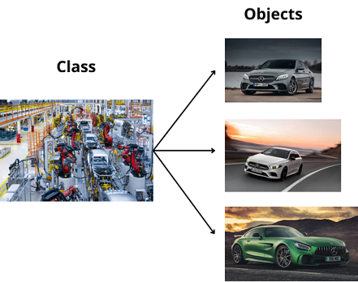

# Object Oriented Programming


## Content

- [Object Oriented Programming](#object-oriented-programming)
  - [Content](#content)
    - [Introduction](#introduction)
    - [Objects](#objects)
    - [Classes](#classes)
    - [OOP Principles](#oop-principles)
    - [how to define classes and objects.](#how-to-define-classes-and-objects)
    - [Example.](#example)

### Introduction

C# is a object oriented language, but what does it mean?
It is a programming paradigm that organise the software aroun the concept of objects

### Objects

But what is an object?  
We can see an object as a data structure where we store information organized into fields and methods (functions). Objects are a block of memory.

An object is also called an instance.

### Classes

A class is basically a blueprint for creating different types of objects. Since C# is a strongly typed language, when we create a class, we are defining a new data type.

**Relationship between Objects and Classes**

An `object` is an `instance` of a `class`, representing a specific `entity` with a defined state `(fields)` and behavior `(methods)`.

In the following example, you can think of:
* A class as a car factory that defines the blueprint for creating cars (robots build and assemble the different parts of the car).
* An object as an individual car, each with its own properties, such as color, max speed, and engine type.



### OOP Principles
* Encapsulation
* Abstraction
* Polymorphism
* Inheritance

### how to define classes and objects.

Defining a new class. We are going to use the keyword `class`
```
access_modifier class Name_of_class
{
  // define fields

  // Define methods
    
    // Constructor: 
    access_modifier Name_of_class(parameters)
    {
      
    }

    // other methods
}
```

Creating an object (instance fo the class). We are going to use the keyword `new`

```
Name_of_class name_of_object = new Name_of_class(arguments);

```
**Note:**
* `class`: The class keyword is used to define a new user-defined data type that encapsulates fields and methods.
* `new`: The new keyword is used to create an instance (object) of a class by allocating memory for it.

### Example.
```csharp
// Defining a new class (a new data type)
class Animal
{
    // Fields (state)
    public string name;
    public string species;
    public int age;

    // Methods (behavior)
    public void MakeSound()
    {
        Console.WriteLine(name + " is making a sound!");
    }

    public void Describe()
    {
        Console.WriteLine("This is a " + species + " named " + name + ", and it is " + age + " years old.");
    }
}


// Creating an instance of the Animal class
Animal myPet = new Animal();
myPet.name = "Buddy";
myPet.species = "Dog";
myPet.age = 5;

// Calling methods on the object
myPet.MakeSound(); // Buddy is making a sound!  
myPet.Describe(); // This is a Dog named Buddy, and it is 5 years old.  

```