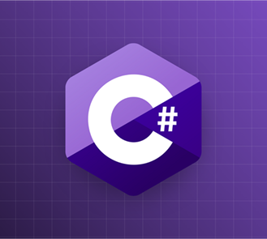

# Welcome to C# course. A course from Zero to Hero.

## About the Course

This course is structured to guide you through the fundamental and advanced topics of C#. Each section will include practical exercises and examples to help reinforce your learning. By the end of this course, you will have the knowledge to build robust applications and solve real-world problems with C#.

## Who is this course for?

- Beginners who want to learn programming and C#
- Developers looking to transition into C#
- Anyone eager to learn object-oriented programming and C# fundamentals

## Prerequisites

No prior programming experience is required. We’ll start from the basics, step by step!

## Course Structure

The course is divided into several sections form basic topics to advanced topics:

1. [Variables and DataTypes](1.%20Variables/Variables.md)  
2. [Operators](2.%20Operators/Operators.md)  
3. [Control structures](3.%20Control%20Structures/Control%20Structures.md)
4. [Data Structures](4.%20Data%20Structures/Data%20Structures.md)
5. [Object Oriented Programming](5.%20OOP/OOP.md)
6. SOLID Principles. 
7. Exception handling. 
8. Unit Testing / Testing Frameworks.
9. Debugging tools.
10. Documentation.
11. Advance data structures: Structs, Enumerates, Delegates, Events.
12. Lambda Expressions.
13. LINQ.
14. Asynchronous programming.
15. Parallel Programming and Threads.
16. Design Patterns.
17. Databases Connection.
18. ORM. Entity Framework.
19. Model - View - Controller.
20. C# for Web Development.
21. Deployment and CI/CD in C#.
